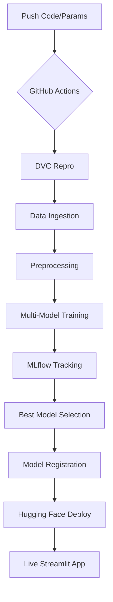

# 📊 Telco Customer Churn Prediction System


An industry-grade, end-to-end MLOps pipeline designed to predict customer churn with **Zero-Manual-Intervention**. The system automatically trains multiple models, selects the best performer, registers it, and deploys it to Hugging Face Spaces.

---

## 🚀 Key Features

- **🔄 Automated CI/CD Pipeline:** Every code or parameter push triggers a full `DVC` reproduction on GitHub Actions.
- **🧪 Multi-Model Experimentation:** Automatically trains **Logistic Regression**, **Random Forest**, and **XGBoost** on every run.
- **🥇 Best Model Selection:** Custom logic selects the champion model based on **ROC-AUC** and promotes it to the Registry.
- **📦 Model Versioning:** Integrated with **MLflow** and **DagsHub** for detailed tracking and model versioning (e.g., Version 15+).
- **🐳 Containerized Deployment:** Uses **Docker** and **Git LFS** to deploy a robust inference engine to Hugging Face.
- **🎨 Premium UI:** Interactive Streamlit dashboard with glassmorphism design and real-time predictions.

---

## 🛠️ Technology Stack

| Component | Technology |
| :--- | :--- |
| **Pipeline** | DVC (Data Version Control) |
| **Tracking** | MLflow |
| **Registry** | DagsHub |
| **Automation** | GitHub Actions |
| **Modeling** | Scikit-learn, XGBoost |
| **Deployment** | Docker, Hugging Face Spaces |
| **Frontend** | Streamlit |

---

## 🏗️ Architecture & Flow



---

## 💻 Local Setup

1. **Clone the repository:**
   ```bash
   git clone https://github.com/Muneebkhan1457/Teleco-Customer-Churn-.git
   cd Teleco-Customer-Churn-
   ```

2. **Install dependencies:**
   ```bash
   pip install -r requirements.txt
   ```

3. **Configure Environment:** Create a `.env` file with your DagsHub credentials.

4. **Run the Pipeline:**
   ```bash
   dvc repro
   ```

5. **Launch the UI:**
   ```bash
   streamlit run streamlit_app.py
   ```

---

## 📈 Experiment Tracking
All experiments are logged to **DagsHub**. You can view model architectures, ROC-AUC curves, and feature importance directly in the [MLflow Dashboard](https://dagshub.com/Muneebkhan1457/Teleco-Customer-Churn-.mlflow).

---
*Developed with ❤️ by [Muneeb Khan](https://github.com/Muneebkhan1457)*
